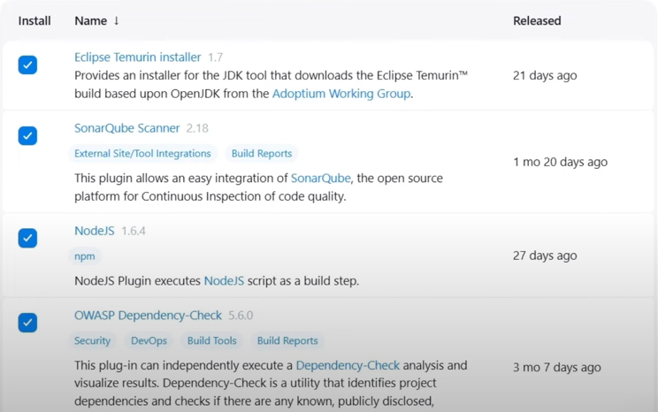
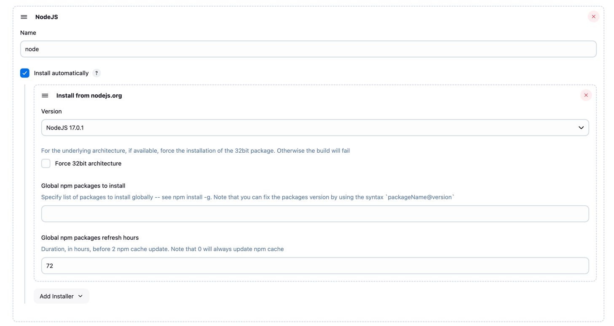
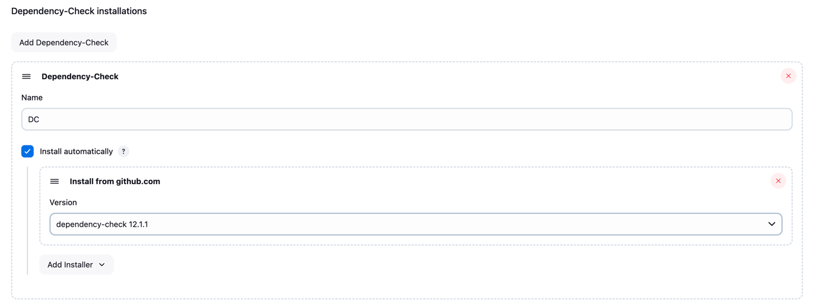
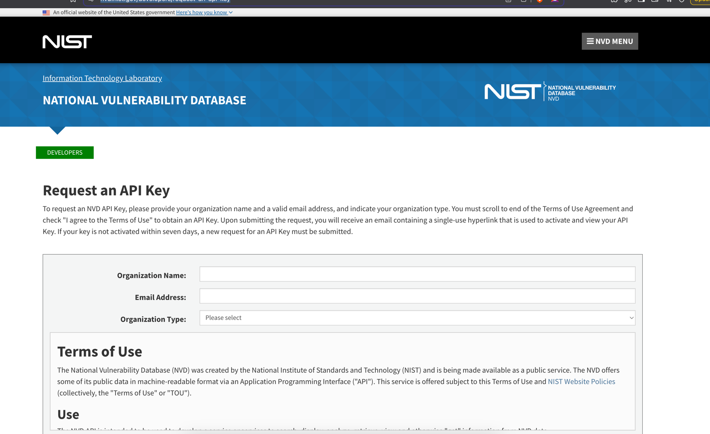

# pipelines to 
Eclipse Temurin installer Version
KubernetesVersion
Kubernetes Credentials Provider
Kubernetes CLI
Kubernetes Client API
pipeline stage view
OWASP Dependency-Check

https://github.com/dependency-check/DependencyCheck

https://nvd.nist.gov/developers/request-an-api-key

